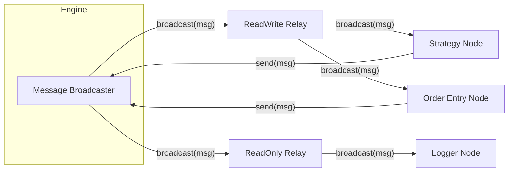

# Coinbus

An event-driven cryptocurrency trading platform built in Python. Designed for automated algorithmic trading on Binance, it features a modular node-based architecture and emphasizes core principles such as process isolation, strict type safety, and zero-allocation message passing.

## Architecture

### Core Concepts

- **Nodes**: Independent processing units that run in their own isolated processes. Each node handles a specific responsibility (e.g., `BinanceMarketDataStreamClientNode`) and communicates asynchronously with other nodes. There are two types:
  - **`ReadWriteNode`**: Can both receive messages from the engine and send messages back (e.g., strategy nodes, order entry nodes).
  - **`ReadOnlyNode`**: Can only receive messages from the engine (e.g., logging nodes).
- **Messages**: All data exchange occurs via strictly typed, serialized messages defined in `.typedef` schemas.
- **Engine**: The central orchestrator. It manages the lifecycle of all nodes and broadcasts messages between them.



### Directory Layout

- **`core/`** — Engine, base node classes, message serialization, code generator, and core infrastructure.
- **`application/`** — Business logic modules, organized by domain:
  - **`algo/`** — Trading algorithms and strategies.
  - **`marketdata/`** — Exchange market data stream connectors.
  - **`orderentry/`** — Order execution (simulated and live).
  - **`referencedata/`** — Exchange reference data connectors.
  - **`signal/`** — Derived market signals and indicators.
  - **`timer/`**, **`filelogger/`**, **`notification/`**, **`account/`**, **`pingpong/`** — Supporting infrastructure (heartbeats, logging, email alerts, account data, examples).
- **`common/`** — Shared utilities and data structures (time helpers, custom types like `WFloat`, circular buffers, object pools).
- **`generated/`** — Python classes auto-generated by `codegen.sh`. **Do not edit these files manually.**

## Getting Started

### Prerequisites

- **Python 3.12** (strict requirement)
- **Binance API Credentials** (required for live and simulated trading in the PROD or TEST environments)

### Installation

1. **Clone the repository**
    ```bash
    git clone <repository-url>
    cd coinbus
    ```

2. **Build the environment**

    Run the build script to create the virtual environment and generate Python message classes from `.typedef` schemas:
    ```bash
    sh build.sh
    ```
    *This script creates a virtual environment (`venv`), installs dependencies from `requirements.txt`, and runs the code generator (`codegen.sh`).*

3. **Configure credentials**

    Create a `.env` file in the project's root directory and replace the placeholders with your credentials:
    ```
    # Binance API (required by the resources util available to all nodes)
    ## Prod
    BINANCE_PROD_API_KEY=your_api_key
    BINANCE_PROD_API_SECRET=your_api_secret

    ## Test
    BINANCE_TEST_API_KEY=your_api_key
    BINANCE_TEST_API_SECRET=your_api_secret

    # Email Notifier (required by the EmailNotifierNode)
    EMAIL_NOTIFIER_SENDER=your_email_address
    EMAIL_NOTIFIER_PASSWORD=your_email_api_password

    # Email Notifier SMTP (optional, defaults to Gmail)
    # EMAIL_NOTIFIER_SMTP_HOST=smtp.gmail.com
    # EMAIL_NOTIFIER_SMTP_PORT=465
    ```

### Running the System

Try the PingPong example, which demonstrates basic node communication by having ping nodes send messages to pong nodes, which then reply:

```bash
source venv/bin/activate
python3 main-pingpong.py
```

### Example Entry Points

| Script | Description |
|---|---|
| `main-pingpong.py` | Demonstrates basic node communication with configurable ping–pong games. |
| `main-testmarketdata.py` | Connects to Binance and streams live market data for configured symbols. |
| `main-testorderentry.py` | Tests order entry flow using the simulated order execution node. |
| `main-testtimer.py` | Runs the timer node to verify heartbeat message delivery. |

## Principles & Patterns

This system is built upon several key principles:

### 1. Process Isolation
Every node runs in a separate system process using Python's `multiprocessing` library. This ensures that a failure in one component (e.g., a strategy error) does not crash the entire system or affect critical components like order execution.

### 2. Event-Driven Architecture
The system is reactive. Nodes remain in an idle state until they receive a message (such as a market tick, an order fill, or a timer heartbeat), at which point they process the event and produce a new event(s).

### 3. Type-Safe Messaging
Messages are defined in `.typedef` schema files. A custom code generator (`codegen.sh`) compiles these schemas into Python classes with strict type hinting, supporting data integrity across process boundaries.

### 4. Object Pooling
To minimize Python Garbage Collection (GC) overhead during runtime, the system uses **Object Pooling**. Messages are requested from a pre-allocated pool, and their memory footprint is reduced using Python's `__slots__`. The core components strictly manage message ownership throughout its lifecycle (acquire, populate, send, and release).

### 5. I/O Integration
To bridge the gap between asynchronous external I/O (like WebSocket market data streams) and communication with the engine, nodes utilize a threaded message sender. Data is pushed into thread-safe queues and drained by a **background sender thread**, ensuring messages are injected without blocking the process. When developing nodes that rely heavily on blocking external I/O, ensure this I/O is decoupled from the node's synchronous event loop.

## Development Guide

### Message Schemas

All messages are defined in `.typedef` files located in `*/type/` directories. For example, `application/orderentry/type/orderentry.typedef` defines the `orderentry` message group.

Here is a brief example of a `.typedef` file defining a constant, an enum, and a message:

```
constant int MICROS_TO_NANOS = 1_000

enum str Side ->
    BUY = BUY
    SELL = SELL

msg EnterOrder ->
    common:enum.Venue venue = Venue.BINANCE
    enum.OrderType order_type = OrderType.LIMIT
    str internal_order_id = constant INVALID_INTERNAL_ORDER_ID
    WFloat price
```

For the full `.typedef` language reference — including supported types, namespacing rules, and more examples — see [docs/typedef-reference.md](docs/typedef-reference.md).

**Schema workflow:**
1. **Edit**: Modify or create a `.typedef` file.
2. **Register Group**: If adding a new group (e.g., `newgroup.typedef`), add it to the `MsgGroup` enum in `core/msg/base/msggroup.py`.
3. **Generate**: Run `sh codegen.sh` from the project root.
4. **Use**: Import the generated classes from the `generated/` directory into your application code.

### Common Infrastructure Nodes

Most setups will need a combination of these infrastructure nodes alongside your strategy node:

| Node | Role |
|---|---|
| `TimerNode` | Emits periodic heartbeat messages that drive time-based logic in other nodes. |
| `BinanceMarketDataStreamClientNode` | Connects to Binance WebSocket streams and publishes live trade and order book data. |
| `BinanceReferenceDataClientNode` | Fetches exchange reference data (symbol info, precision constraints). |
| `OrderEntrySimulatorNode` | Simulates order execution locally — use this to validate strategy logic before going live. |
| `FilteredTextFileLoggerNode` | Logs filtered message traffic to text files for debugging and analysis. |
| `TradePriceSignalsNode` | Computes derived signals (VWAP, EMA, returns) from incoming trade data. |

**Live trading only:**

| Node | Role |
|---|---|
| `BinanceOrderEntryClientNode` | Submits and manages real orders on Binance. Replace `OrderEntrySimulatorNode` with this only after thorough simulation testing. |

### Adding a New Strategy

1. **Define messages**: Create a `.typedef` file in `application/algo/type/` to define your strategy's configuration and required messages, then run `sh codegen.sh`.

2. **Create node**: Create a new class that inherits from `ReadWriteNode` in `application/algo/node/`:
    - Subscribe to required market data and signals.
    - Implement handlers for incoming messages (e.g., `_handle_trade`).
    - Implement the core strategy logic to generate orders.
    - Implement callbacks to handle order lifecycle events (e.g., fills, cancels, rejects).

3. **Create entry point**: Create a new `main-*.py` script and configure the `Launcher` to include your node alongside the required infrastructure nodes:

    ```python
    from core.engine.launcher import Launcher
    # ... import your node, infrastructure nodes, and config types

    def run():
        launcher = Launcher(
            environment=EnvironmentEnum.PROD,
            node_klasses=dict(
                TIMER=TimerNode,
                FILTEREDFILELOGGER=FilteredTextFileLoggerNode,
                MDSTREAMCLIENT=BinanceMarketDataStreamClientNode,
                ORDERENTRYCLIENTSIMULATOR=OrderEntrySimulatorNode,
                REFERENCEDATACLIENT=BinanceReferenceDataClientNode,
                TRDPRICESIGNALS=TradePriceSignalsNode,
                MYALGO=MyAlgoNode,
            ),
            node_configuration_msgs=dict(
                MYALGO=[my_algo_config()],
            ),
        )
        try:
            launcher.start(run_duration_seconds=hours_to_seconds(24))
        finally:
            launcher.stop()
    ```

> **Tip**: Always validate your logic with `OrderEntrySimulatorNode` before switching to `BinanceOrderEntryClientNode` for live trading.

## Troubleshooting

- **Import errors?** Run `sh codegen.sh` to ensure all message types are generated.
- **No data?** Check `main-testmarketdata.py` to verify API connectivity.
- **Python version**: Ensure you are using Python 3.12.

---
**Disclaimer**: This software is for educational purposes. Cryptocurrency trading involves substantial risk. Use at your own risk.
